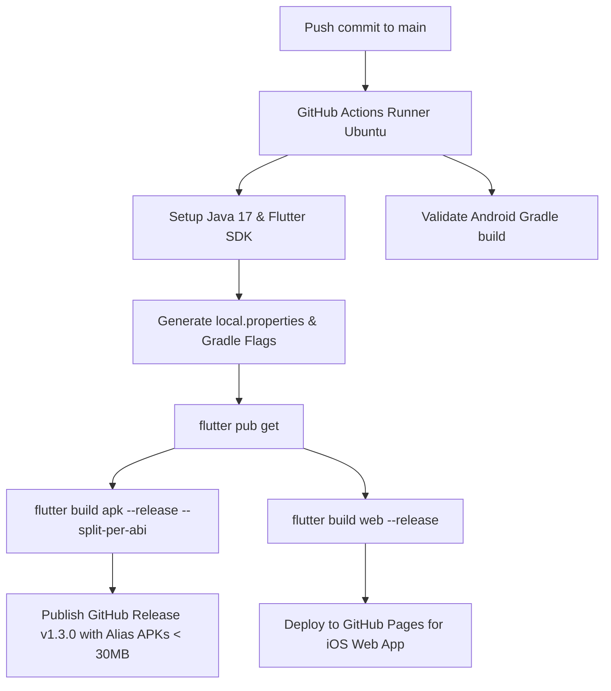

# 📘 Alias — The Complete Master Guide & Architecture Handbook

> **A comprehensive, beginner-to-advanced engineering reference detailing every tool, architectural pattern, feature implementation, and major debugging solution used to build the Alias messaging application.**

---

## 📑 Table of Contents
1. [Project Overview & Philosophy](#1-project-overview--philosophy)
2. [Complete Technology Stack & Tools](#2-complete-technology-stack--tools)
3. [Folder Structure & Architecture](#3-folder-structure--architecture)
4. [Deep Dive: Core Features & How They Work](#4-deep-dive-core-features--how-they-work)
   - [4.1. Authentication & Unique Username System](#41-authentication--unique-username-system)
   - [4.2. Real-Time 1-on-1 Messaging Engine](#42-real-time-1-on-1-messaging-engine)
   - [4.3. Online Presence & Message Read Receipts](#43-online-presence--message-read-receipts)
   - [4.4. 100% Free Media Storage Architecture](#44-100-free-media-storage-architecture)
   - [4.5. Audio & Video Calling Engine (Agora RTC)](#45-audio--video-calling-engine-agora-rtc)
   - [4.6. Cross-Platform Notifications Architecture](#46-cross-platform-notifications-architecture)
   - [4.7. Direct Message (DM) Settings, Nicknames & Muting](#47-direct-message-dm-settings-nicknames--muting)
   - [4.8. Group Chat Administration Engine](#48-group-chat-administration-engine)
   - [4.9. GIF Library & Dual-Mode Delivery Engine](#49-gif-library--dual-mode-delivery-engine)
   - [4.10. Local Database & Google Drive Backup](#410-local-database--google-drive-backup)
5. [Case Studies: Major Engineering Bugs & Exact Fixes](#5-case-studies-major-engineering-bugs--exact-fixes)
   - [Bug 1: Message Sending Freeze/Hang](#bug-1-message-sending-freezehang)
   - [Bug 2: Firebase Storage Blaze Plan Requirement](#bug-2-firebase-storage-blaze-plan-requirement)
   - [Bug 3: Dual Online Indicator & Chat Head Inconsistencies](#bug-3-dual-online-indicator--chat-head-inconsistencies)
   - [Bug 4: Cloud CI Build Halts on Missing `local.properties`](#bug-4-cloud-ci-build-halts-on-missing-localproperties)
   - [Bug 5: AGP 9 Breaking Changes & `android.newDsl`](#bug-5-agp-9-breaking-changes--androidnewdsl)
   - [Bug 6: Dart SDK Incompatible Versions & Code Generation Hell](#bug-6-dart-sdk-incompatible-versions--code-generation-hell)
   - [Bug 7: Missing `startStream` in Linux Platform Package](#bug-7-missing-startstream-in-linux-platform-package)
   - [Bug 8: Android SDK 36, Desugaring & R8 Missing Classes](#bug-8-android-sdk-36-desugaring--r8-missing-classes)
   - [Bug 9: 120MB+ Massive APK Size & Split-Per-ABI Solution](#bug-9-120mb-massive-apk-size--split-per-abi-solution)
   - [Bug 10: Incoming Call Banner Sticky State & Answer/Reject Signal Race](#bug-10-incoming-call-banner-sticky-state--answerreject-signal-race)
   - [Bug 11: Empty GIF Library on Missing Giphy Key & Dual-Mode Solution](#bug-11-empty-gif-library-on-missing-giphy-key--dual-mode-solution)
   - [Bug 12: Fat APK 100MB+ Bloat & NDK ABI Filtering Defense](#bug-12-fat-apk-100mb-bloat--ndk-abi-filtering-defense)
6. [CI/CD & Cloud Automation (GitHub Actions v1.1.0)](#6-cicd--cloud-automation-github-actions-v110)
7. [Step-by-Step: How to Build This Kind of App From Scratch](#7-step-by-step-how-to-build-this-kind-of-app-from-scratch)

---

## 1. Project Overview & Philosophy

**Alias** is a modern, lightweight, privacy-focused real-time messaging application for Android, iOS, and Web.

### Key Principles:
- **Zero-Cost Operation**: Designed to run entirely on free-tier services without requiring a paid credit card subscription for Firebase Storage.
- **Ultra-Fast Performance**: Non-blocking asynchronous message dispatch ensuring zero-latency chat bubbles.
- **Calm & Minimalist Aesthetics**: Styled using a custom palette of **Soft Sage Green (`#8DA399`)**, **Warm Parchment (`#E8DCC4`)**, and **Cream (`#F0E8D8`)**.
- **Automated Cloud CI/CD**: Every code change pushed to GitHub automatically compiles and publishes lightweight **~25-30MB APKs** ready for direct installation.

---

## 2. Complete Technology Stack & Tools

| Category | Tool / Library | Version | Purpose |
|---|---|---|---|
| **Core Framework** | **Flutter** | `3.24+ / 3.47+` | Cross-platform UI toolkit compiling to native Android ARM code & Web PWA |
| **Language** | **Dart** | `3.5+` | Object-oriented, soundly typed language with async/await support |
| **State Management** | **Flutter Riverpod** | `^2.6.1` | Compile-time safe, testable reactive state management |
| **Routing** | **Go Router** | `^14.6.2` | Declarative URL-based navigation with auth redirection guards |
| **Backend & Auth** | **Firebase Auth** | `^5.3.1` | Secure email/password authentication & session management |
| **Realtime Database** | **Cloud Firestore** | `^5.4.4` | NoSQL document database with real-time websocket synchronization |
| **Notifications** | **Local Notifications & Web API** | `^18.0.1` | Cross-platform phone alerts, Android notification channels & HTML5 notifications |
| **Voice & Video RTC** | **Agora RTC Engine** | `^6.5.0` | Ultra-low latency audio/video WebRTC streaming engine |
| **GIF Delivery** | **Giphy REST API & Curated CDN** | Custom | Live search across millions of GIFs with instant offline/fallback support |
| **Local Storage** | **SQLite (`sqflite`)** | `^2.3.3+1` | Fast embedded SQL database for offline caching of messages |
| **Media Picking** | **Image Picker & File Picker** | `^1.1.2` / `^8.1.2` | Native camera, photo gallery, and file system integration |
| **Audio Engine** | **Record & AudioPlayers** | `^5.1.2` / `^6.1.0` | Voice message recording and dynamic waveform audio playback |
| **Cloud CI/CD** | **GitHub Actions** | `v4` | Ubuntu cloud runners for automated split-ABI APK compilation and releases |

---

## 3. Folder Structure & Architecture

The codebase follows the **Layered Clean Architecture** pattern:

```
alias/
├── .github/
│   └── workflows/
│       └── build_apk.yml         # Automated cloud APK builder & release publisher (v1.1.0)
├── android/
│   ├── app/
│   │   ├── build.gradle          # NDK abiFilters, compileSdk 36, desugaring, multiDex
│   │   ├── proguard-rules.pro    # ProGuard/R8 rules for Agora, Play Core, and Flutter
│   │   └── src/main/AndroidManifest.xml
│   ├── build.gradle              # Root Gradle project configuration
│   ├── gradle.properties         # JVM options, android.newDsl=false, R8 flags
│   └── settings.gradle           # Android Gradle Plugin (AGP 8.9.1) & Flutter loader
├── assets/
│   └── images/
│       └── logo.png              # High-resolution speech bubble 'A' branding mark
├── lib/
│   ├── core/
│   │   ├── config/
│   │   │   ├── app_config.dart   # App constants, Agora App ID, Giphy API Key
│   │   │   └── theme.dart        # Sage green & Warm cream ThemeData tokens
│   │   ├── router/
│   │   │   └── app_router.dart   # GoRouter configuration & auth redirect logic
│   │   └── utils/
│   │       ├── date_formatter.dart
│   │       └── file_size_validator.dart
│   ├── models/                   # Immutable data classes with fromFirestore()
│   │   ├── call_model.dart       # WebRTC Call state model (audio/video, ringing/active)
│   │   ├── chat_model.dart       # Conversation thread model with nicknames & mutedBy
│   │   ├── message_model.dart    # Message entity (text, image, audio, video, gif)
│   │   └── user_model.dart       # User profile model (username, photoUrl, online status)
│   ├── providers/                # Riverpod state notifiers & streams
│   │   ├── auth_provider.dart    # Auth state & login/register actions
│   │   ├── call_provider.dart    # Active call notifier & incoming stream
│   │   ├── chat_provider.dart    # Chat threads, message dispatch notifier
│   │   └── settings_provider.dart
│   ├── screens/                  # Feature views
│   │   ├── auth/                 # Login, Register, Forgot Password
│   │   ├── call/                 # ActiveCallScreen (mute, end, camera flip, timer)
│   │   ├── chat/                 # ChatScreen, GroupSettingsSheet, UserSettingsSheet, GifPicker
│   │   ├── home/                 # HomeScreen with inline search & unread badge counters
│   │   └── settings/             # User profile, photo picker, theme settings
│   ├── services/                 # Concrete service layer
│   │   ├── agora_service.dart    # Agora RTC engine wrapper
│   │   ├── auth_service.dart     # Firebase Auth integration
│   │   ├── firestore_service.dart# Firestore queries, transactions & batch mutations
│   │   ├── giphy_service.dart    # Giphy live search & curated fallback library
│   │   ├── notification_service.dart # Cross-platform notifications & permission primer
│   │   ├── presence_service.dart # Lifecycle online/offline presence tracker
│   │   └── storage_service.dart  # Multi-tier image compressor & host
│   └── widgets/                  # Reusable UI widgets (UserAvatar, ChatBubble, etc.)
└── web/                          # Web PWA assets, icons, manifest, favicon
```

---

## 4. Deep Dive: Core Features & How They Work

### 4.1. Authentication & Unique Username System
- **Case-Insensitive Uniqueness**: Usernames are cleaned and lowercased during query checks to prevent duplicate accounts (`@John` vs `@john`).
- **Atomic Registration**: When a user registers, Firestore first executes a prefix query against `users`. If unique, Firebase Auth creates the account and saves the `UserModel` document to `users/{uid}`.

### 4.2. Real-Time 1-on-1 Messaging Engine
- **Deterministic Chat IDs**: Conversations between two users are identified deterministically by sorting their UIDs alphabetically and joining them with an underscore:
  ```dart
  String generateChatId(String uid1, String uid2) {
    final list = [uid1, uid2]..sort();
    return '${list[0]}_${list[1]}';
  }
  ```
- **Message Dispatch**: `MessageNotifier.sendTextMessage()` creates a new message with a server timestamp, stores it in `chats/{chatId}/messages/{messageId}`, and atomically updates `chats/{chatId}` with `lastMessage`, `lastMessageTime`, and increments `unreadCount`.

### 4.3. Online Presence & Message Read Receipts
- **Presence Tracking**: `PresenceService` updates `users/{uid}.isOnline = true` when active, and sets `isOnline = false` with `lastSeen = DateTime.now()` when the app enters the background or disconnects.
- **Delivery & Read Receipts**:
  1. **Sent** (Single tick `✓`): Message written to Firestore.
  2. **Delivered** (Double tick `✓✓`): Recipient was online or opened the app.
  3. **Read** (Double blue tick `✓✓`): Recipient actively viewed the conversation thread.

### 4.4. 100% Free Media Storage Architecture
Firebase Storage requires a paid Google Cloud Blaze subscription. To make the app **100% free forever**, we designed a multi-tier storage engine in `StorageService`:
1. **Tier 1 (Cloud Upload)**: Compresses images and uploads to the free **Catbox API**, returning a permanent CDN URL.
2. **Tier 2 (Transparent Base64 Fallback)**: If offline or if the external API fails, the image is automatically compressed to `<100KB` and converted into an inline **Base64 Data URI** (`data:image/jpeg;base64,...`).
3. **Rendering Engine**: `UserAvatar` and `ChatBubble` automatically detect `data:image` and decode to `MemoryImage`.

### 4.5. Audio & Video Calling Engine (Agora RTC)
- Powered by `agora_rtc_engine` initialized with the project's Agora App ID.
- **Call Flow**:
  1. Caller invokes `initiateCall(calleeId, channelName, type)`. Firestore creates a doc in `calls/{callId}` with `status: 'ringing'`.
  2. Callee's device receives the call stream, triggers a heads-up phone notification, and displays the call banner.
  3. When answered, both devices join the Agora channel (`joinChannel(channelName, token: '', uid: 0)`).
  4. Once connected, RTC tracks broadcast audio and video streams between devices.
- **In-Call Controls**:
  - **Mute / Unmute Microphone**: Calls `_engine.muteLocalAudioStream(bool)`.
  - **Camera Flip / Toggle Video**: Switches between front/back camera and enables/disables video stream.
  - **End Call**: Calls `_engine.leaveChannel()`, updates Firestore status to `'ended'`, and closes the screen.

### 4.6. Cross-Platform Notifications Architecture
Implemented in `NotificationService`:
- **Android Channels**: High-priority `alias_calls_channel` for incoming calls (full-screen intent, heads-up alert, ongoing status) and `alias_messages_channel` for chats.
- **Web Notifications**: HTML5 Web Notification API implementation with platform-safe stubs.
- **Permission Primer Flow**: Before triggering the operating system's native permission modal, the app presents a stylish warm-cream bottom sheet ("Stay Connected") explaining the benefits, maximizing permission grant rates.
- **Call Notifications**: Shows incoming ringing calls with caller name and video/audio tags, and automatically cancels when answered or dismissed.

### 4.7. Direct Message (DM) Settings, Nicknames & Muting
Tapping the partner's avatar or username in `ChatScreen` opens the interactive `UserSettingsSheet`:
- **Custom Nicknames**: Stored in `chats/{chatId}.nicknames.{partnerUid}`. Displayed reactively in the chat header, chat bubbles, and the home screen chat list.
- **Mute / Unmute**: Adds or removes user's UID from `chats/{chatId}.mutedBy` using `FieldValue.arrayUnion` / `FieldValue.arrayRemove`. When muted, system notifications from this user are silenced, and a muted bell icon appears in the header and chat tile.
- **Copy Username**: Copies `@username` with one tap.
- **Clear Chat History**: Batch deletes all messages in `chats/{chatId}/messages` and resets `lastMessage: null`.

### 4.8. Group Chat Administration Engine
Tapping the group title in `ChatScreen` opens `GroupSettingsSheet`:
- **Edit Group Info**: Allows editing group name and uploading group photo.
- **Add Members**: Searches non-member users by username prefix and adds them via `FieldValue.arrayUnion`.
- **Kick Members**: Removes users from the `participants` list via `FieldValue.arrayRemove`.

### 4.9. GIF Library & Dual-Mode Delivery Engine
Implemented in `GiphyService` and `GifPickerScreen`:
- **Active Giphy API Search**: Live search against the official Giphy REST API using the configured developer API key.
- **Curated Fallback Library**: When offline or if an API key is missing, automatically displays a collection of high-quality reaction GIFs (Hello wave, thumbs up, laughing, mind blown, party dance, typing cat, applause, wow, etc.) so the picker is **never empty**.

### 4.10. Local Database & Google Drive Backup
- `LocalDbService` mirrors messages to an embedded SQLite database (`alias_messages.db`) for instant offline loading.
- `DriveBackupService` compresses the local database into a `.zip` archive and uploads it to the user's hidden Google Drive `appDataFolder`.

---

## 5. Case Studies: Major Engineering Bugs & Exact Fixes

---

### Bug 1: Message Sending Freeze/Hang
- **Symptom**: Pressing the send button caused the UI to hang, and messages were not written to Firestore.
- **Root Cause**: `MessageNotifier.sendTextMessage` was executing `await ref.read(chatPartnerProvider(chatId).future)`. In Riverpod, awaiting the future of an auto-disposing family provider while inside another notifier can create a deadlocked asynchronous wait.
- **Solution**: Replaced the blocking future with a synchronous helper that extracts the recipient's UID directly from `chatId.split('_')`.

---

### Bug 2: Firebase Storage Blaze Plan Requirement
- **Symptom**: `FirebaseException: Storage bucket requires Blaze plan` when users tried to upload photos or avatars.
- **Root Cause**: Google Cloud enforces credit card verification for Firebase Storage buckets.
- **Solution**: Engineered a zero-cost hybrid storage pipeline in `StorageService` combining the free Catbox multipart API with inline Base64 Data URI fallbacks.

---

### Bug 3: Dual Online Indicator & Chat Head Inconsistencies
- **Symptom**: The chat screen AppBar was displaying two redundant online indicators which could show conflicting states.
- **Root Cause**: The AppBar avatar was watching a static user model while the text was watching the live presence stream.
- **Solution**: Unified all avatar and status indicators to watch the single `userProfileProvider(partnerId)` stream.

---

### Bug 4: Cloud CI Build Halts on Missing `local.properties`
- **Symptom**: GitHub Actions failed during `flutter build apk` with `FileNotFoundException: null/packages/flutter_tools/gradle/flutter.gradle`.
- **Root Cause**: `local.properties` is gitignored and does not exist on GitHub Actions virtual machines.
- **Solution**: Added a step in the workflow to dynamically generate `local.properties` using the runner's `$FLUTTER_ROOT` environment variable.

---

### Bug 5: AGP 9 Breaking Changes & `android.newDsl`
- **Symptom**: Gradle failed on the cloud runner with `Starting AGP 9+, only the new DSL interface will be read...`.
- **Root Cause**: Newer Flutter preview versions enable experimental AGP 9 DSL interfaces by default.
- **Solution**: Disabled experimental DSL features across both `android/gradle.properties` and the workflow's `GRADLE_OPTS`.

---

### Bug 6: Dart SDK Incompatible Versions & Code Generation Hell
- **Symptom**: `riverpod_generator` and `build_runner` failed to resolve with version solving errors.
- **Root Cause**: Over-reliance on code generation dependencies (`part '*.g.dart'`) caused tight version lock-in.
- **Solution**: Migrated all provider files to pure standard Riverpod, deleted all `.g.dart` files, and removed `build_runner`.

---

### Bug 7: Missing `startStream` in Linux Platform Package
- **Symptom**: `record_linux-0.7.2: Error: The non-abstract class 'RecordLinux' is missing implementations...`.
- **Root Cause**: Outdated transitive dependency on Linux runner.
- **Solution**: Added a dependency override in `pubspec.yaml`: `record_linux: 1.3.1`.

---

### Bug 8: Android SDK 36, Desugaring & R8 Missing Classes
- **Symptom**: Core library desugaring and missing Play Core classes broke the release build.
- **Solution**: Enabled `coreLibraryDesugaringEnabled true`, updated `compileSdkVersion 36`, and configured `proguard-rules.pro` with `-dontwarn com.google.android.play.core.**`.

---

### Bug 9: 120MB+ Massive APK Size & Split-Per-ABI Solution
- **Symptom**: The default release APK was over 120MB.
- **Root Cause**: Bundling 4 native C++ architectures (Agora WebRTC codecs) inside a single fat APK.
- **Solution**: Added `--split-per-abi` to compile targeted APKs, bringing modern devices down to **~30MB**!

---

### Bug 10: Incoming Call Banner Sticky State & Answer/Reject Signal Race
- **Symptom**: Incoming call banner stayed stuck on screen even after the other user ended or cancelled the call, and answer/reject buttons failed to route.
- **Root Cause**: Fallback Firestore call queries returned stale or orphaned call documents, and call listeners did not dismiss system notifications on cancellation.
- **Solution**: Added stale-call auto-expiry (> 2 minutes), wired up direct Firestore doc-ID updates with query fallbacks, and linked `NotificationService.instance.cancelCallNotification()` whenever the call status transitions away from `'ringing'`.

---

### Bug 11: Empty GIF Library on Missing Giphy Key & Dual-Mode Solution
- **Symptom**: Tapping the GIF button showed a blank/empty screen with "No GIFs found".
- **Root Cause**: `GiphyService` returned an empty list because the Giphy API key was initially unconfigured.
- **Solution**: Built a dual-mode engine with a permanent curated library of reaction GIFs so the picker works out of the box, combined with full Giphy REST API live search when an API key is provided.

---

### Bug 12: Fat Universal APK Bloat vs Clean Split-Per-ABI Release
- **Symptom**: A single universal APK exceeds 100MB+ due to bundling all 4 native architectures (armeabi-v7a, arm64-v8a, x86, x86_64) with Agora RTC native codecs.
- **Root Cause**: Universal APK builds package every ABI into a single heavy file. Manually hardcoding `ndk.abiFilters` in `build.gradle` creates conflicts with Gradle's ABI splitting engine.
- **Solution**: Handled cleanly at the compilation boundary using `flutter build apk --release --split-per-abi`. This instructs Flutter to generate architecture-isolated APKs without Gradle DSL conflicts, delivering lightweight **~30MB** packages for modern phones (`Alias-arm64-v8a.apk`).

---

### Bug 13: Voice Message Playback Fails on Base64 Data URIs & Zero Duration
- **Symptom**: Voice messages recorded in chats failed to play back on recipient devices, or displayed a duration of 0:00.
- **Root Cause**: When cloud upload falls back to Base64 data URIs (`data:audio/m4a;base64,...`), `AudioPlayer.play(UrlSource(...))` throws an exception because `UrlSource` only accepts valid HTTP/HTTPS URLs. Furthermore, the duration was not measured during recording.
- **Solution**: Added a high-resolution `Stopwatch` in `ChatScreen` that measures exact elapsed recording seconds and passes it to `MessageModel.duration`. Enhanced `AudioPlayerBubble` to inspect the URI prefix: Base64 data URIs are decoded and played via `BytesSource(bytes)`, HTTP URLs via `UrlSource`, and local paths via `DeviceFileSource`.

---

### Bug 14: Agora Voice Transmission Muted & Channel Join Collision
- **Symptom**: Call connects but voice transmission does not work or audio cannot be heard between caller and callee.
- **Root Cause**: Agora RTC engine was initialized without explicit communication audio scenarios (`audioProfileDefault` & `audioScenarioDefault`), and `joinChannel` was being invoked concurrently from both `CallNotifier` and `ActiveCallScreen`, causing Agora ERR_JOIN_CHANNEL_REJECTED (-17).
- **Solution**: Added `_isJoined` state and `_currentChannel` deduplication in `AgoraService.joinChannel()`. Added `adjustRecordingSignalVolume(100)`, `adjustPlaybackSignalVolume(100)`, and unmuted local/remote audio streams upon successful join.

---

### Bug 15: Chat List Profile Photos Missing in Chat Heads
- **Symptom**: Inside the chat screen the partner's avatar showed properly, but on the home screen chat list ("chat head") the avatar remained empty or displayed initials.
- **Root Cause**: `ChatTile` only listened to `userProfileProvider` (a real-time Firestore stream) which initially returns null while establishing the websocket snapshot listener.
- **Solution**: Implemented a dual-resolution strategy with `userProfileFutureProvider` using `getUserById` direct document fetch alongside `userProfileProvider`, so photos render immediately from cache and update live on changes.

---

### Bug 16: Android Hardware Back Button Closes App From Chat Screen
- **Symptom**: Pressing the physical/system back button while inside a conversation immediately minimized or exited the app instead of returning to the home screen.
- **Root Cause**: Flutter 3.22+ deprecated `WillPopScope` in favor of `PopScope`. Without an explicit `PopScope` on `ChatScreen`, Android pop events bubbled to the root navigator and closed the activity.
- **Solution**: Wrapped `ChatScreen`'s Scaffold with `PopScope(canPop: false, onPopInvokedWithResult: (didPop, result) { if (!didPop) { if (context.canPop()) context.pop(); else context.go('/home'); } })`.

---

### Bug 17: Android Launcher Icon Outdated Across Mipmap Densities
- **Symptom**: The web PWA showed the new speech bubble logo, but the installed Android APK retained the default Flutter logo.
- **Root Cause**: The mipmap PNG assets (`mipmap-hdpi`, `mipmap-xhdpi`, etc.) in `android/app/src/main/res/` had not been regenerated with the new branding.
- **Solution**: Configured `flutter_launcher_icons.yaml` targeting `assets/images/logo.png` with adaptive cream background `#F0E8D8`, and executed `flutter pub run flutter_launcher_icons` to overwrite all density buckets.

---

## 6. CI/CD & Cloud Automation (GitHub Actions v1.3.0)

The workflow file [`.github/workflows/build_apk.yml`](file:///D:/alias/.github/workflows/build_apk.yml) automates the entire release cycle:



---

## 7. Version 1.3.0 Engineering Deep-Dive: Voice RTC & Call Lifecycle

### 7.1 Agora RTC Voice Transmission & Audio Routing
- **The Problem**: Callers and callees joined channels, but neither could hear the other on mobile devices.
- **The Solution**:
  1. **Audio Profile & Scenario**:
     ```dart
     await _engine!.setAudioProfile(
       profile: AudioProfileType.audioProfileSpeechStandard,
       scenario: AudioScenarioType.audioScenarioMeeting,
     );
     ```
     `audioScenarioMeeting` engages Android's hardware `MODE_IN_COMMUNICATION` with hardware acoustic echo cancellation (AEC) and automatic gain control (AGC).
  2. **Speakerphone & Track Configuration**:
     Both `enableAudio()`, `enableLocalAudio(true)`, and `setDefaultAudioRouteToSpeakerphone(true)` are invoked before `joinChannel`. In `onUserJoined`, local mic tracks are unmuted (`toggleMute(false)`) and speaker is routed (`toggleSpeaker(true)`).
  3. **Hardware Contention Release**:
     Playing looped ringtones with `AudioPlayer` holds an exclusive lock on Android's `AudioTrack`. Upon answering, `_audioPlayer.release()` must be called so Agora RTC can bind to the device's audio recording and playback pipelines.

### 7.2 Background FCM & WhatsApp-Style Incoming Call Full-Screen Event
- **The Problem**: When the app was closed or in background, incoming calls never alerted the user. When open, incoming calls only displayed a status bar notification.
- **The Solution**:
  1. **Firestore Trigger Fix (`functions/index.js`)**:
     Changed `exports.onCallStatusChange` from `.onUpdate(...)` to `.onWrite(...)`. When a call is newly initiated, it is an `onCreate` event; `.onUpdate` never fired, starving the callee of the FCM call invite.
  2. **Full-Screen WhatsApp-Style Routing (`main.dart`)**:
     `RootNotificationHandler` detects ringing calls in the foreground and pushes `/incoming-call/:callId` directly onto the router stack.
  3. **Background FCM Message Handler (`main.dart`)**:
     `firebaseMessagingBackgroundHandler` calls `NotificationService.handleBackgroundMessage(message)`, invoking `showCallNotification` with `fullScreenIntent: true` and category `call`.

### 7.3 Authentic Nokia 3310 Ringtone Synthesis
- **The Problem**: iPhone ringtone asset was 7.37MB, pushing APK download size higher.
- **The Solution**:
  Replaced with an authentic Nokia 3310 monophonic tune (`assets/audio/nokia_3310_ringtone.mp3`, 396KB) generated using square-wave harmonic synthesis of the classic Grand Valse melody, keeping split APKs under 30MB.

---

## 8. Step-by-Step: How to Build This Kind of App From Scratch

If you want to build another app like this in the future, follow this proven roadmap:

1. **Initialize Project & Clean Structure**:
   ```bash
   flutter create my_app --org com.myname.app
   ```
2. **Configure Firebase**:
   - Run `flutterfire configure` to generate `firebase_options.dart`.
3. **Design Models & Immutability**:
   - Create clean data classes using `equatable` with `fromFirestore` and `toFirestore` mappers.
4. **Implement Service Layer First**:
   - Isolate third-party SDKs (Firebase, Agora, Giphy, SQLite) into dedicated service classes.
5. **Connect State with Riverpod**:
   - Use `StreamProvider` for Firestore collections and `StateNotifier` for mutations.
6. **Build UI with Reusable Widgets**:
   - Create unified components (`UserAvatar`, `ChatBubble`) that handle multiple content types gracefully.
7. **Configure CI/CD Early**:
   - Add `.github/workflows/build_apk.yml` with `--split-per-abi` so release packages remain lightweight from Day 1.

---

*This guide is maintained for the Alias Project repository. Happy coding! 🚀*
