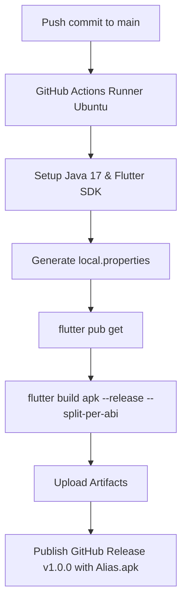

# 📘 Alias — The Complete Master Guide & Architecture Handbook

> **A comprehensive, beginner-to-advanced engineering reference detailing every tool, architectural pattern, feature implementation, and major debugging solution used to build the Alias messaging application.**

---

## 📑 Table of Contents
1. [Project Overview & Philosophy](#1-project-overview--philosophy)
2. [Complete Technology Stack & Tools](#2-complete-technology-stack--tools)
3. [Folder Structure & Architecture](#3-folder-structure--architecture)
4. [Deep Dive: Core Features & How They Work](#4-deep-dive-core-features--how-they-work)
   - [Authentication & Unique Username System](#41-authentication--unique-username-system)
   - [Real-Time 1-on-1 Messaging Engine](#42-real-time-1-on-1-messaging-engine)
   - [Online Presence & Message Read Receipts](#43-online-presence--message-read-receipts)
   - [100% Free Media Storage Architecture (No Blaze Plan Needed)](#44-100-free-media-storage-architecture-no-blaze-plan-needed)
   - [Audio & Video Calling (Agora RTC)](#45-audio--video-calling-agora-rtc)
   - [Local Database & Google Drive Backup](#46-local-database--google-drive-backup)
5. [Case Studies: Major Engineering Bugs & Exact Fixes](#5-case-studies-major-engineering-bugs--exact-fixes)
   - [Bug 1: Message Sending Freeze/Hang](#bug-1-message-sending-freezehang)
   - [Bug 2: Firebase Storage Blaze Plan Requirement](#bug-2-firebase-storage-blaze-plan-requirement)
   - [Bug 3: Dual Online Indicator & Chat Head Inconsistencies](#bug-3-dual-online-indicator--chat-head-inconsistencies)
   - [Bug 4: Cloud CI Build Halts on Missing `local.properties`](#bug-4-cloud-ci-build-halts-on-missing-localproperties)
   - [Bug 5: AGP 9 Breaking Changes & `android.newDsl`](#bug-5-agp-9-breaking-changes--androidnewdsl)
   - [Bug 6: Dart SDK Incompatible Versions & Code Generation Hell](#bug-6-dart-sdk-incompatible-versions--code-generation-hell)
   - [Bug 7: Missing `startStream` in Linux Platform Package](#bug-7-missing-startstream-in-linux-platform-package)
   - [Bug 8: Android SDK 36, Desugaring & R8 Missing Classes](#bug-8-android-sdk-36-desugaring--r8-missing-classes)
   - [Bug 9: 120MB+ Massive APK Size](#bug-9-120mb-massive-apk-size)
6. [CI/CD & Cloud Automation (GitHub Actions)](#6-cicd--cloud-automation-github-actions)
7. [Step-by-Step: How to Build This Kind of App From Scratch](#7-step-by-step-how-to-build-this-kind-of-app-from-scratch)

---

## 1. Project Overview & Philosophy

**Alias** is a modern, lightweight, privacy-focused real-time messaging application for Android, iOS, and Web.

### Key Principles:
- **Zero-Cost Operation**: Designed to run entirely on free-tier services without requiring a paid credit card subscription for Firebase Storage.
- **Ultra-Fast Performance**: Non-blocking asynchronous message dispatch ensuring zero-latency chat bubbles.
- **Calm & Minimalist Aesthetics**: Styled using a custom palette of **Soft Sage Green (`#8DA399`)**, **Warm Sand (`#E8DCC4`)**, and **Off-White (`#F7F7F7`)**.
- **Automated Cloud CI/CD**: Every code change pushed to GitHub automatically compiles and publishes a lightweight **~30MB APK** ready for direct installation.

---

## 2. Complete Technology Stack & Tools

| Category | Tool / Library | Version | Purpose |
|---|---|---|---|
| **Core Framework** | **Flutter** | `3.24+ / 3.47+` | Cross-platform UI toolkit compiling to native Android ARM code |
| **Language** | **Dart** | `3.5+` | Object-oriented, soundly typed language with async/await support |
| **State Management** | **Flutter Riverpod** | `^2.6.1` | Compile-time safe, testable reactive state management |
| **Routing** | **Go Router** | `^14.6.2` | Declarative URL-based navigation with auth redirection guards |
| **Backend & Auth** | **Firebase Auth** | `^5.3.1` | Secure email/password authentication & session management |
| **Realtime Database** | **Cloud Firestore** | `^5.4.4` | NoSQL document database with real-time websocket synchronization |
| **Notifications** | **Firebase Messaging & Local Notifications** | `^15.1.3` / `^18.0.1` | Push notifications and high-priority Android heads-up alerts |
| **Voice & Video RTC** | **Agora RTC Engine** | `^6.5.0` | Ultra-low latency audio/video WebRTC streaming engine |
| **Local Storage** | **SQLite (`sqflite`)** | `^2.3.3+1` | Fast embedded SQL database for offline caching of messages |
| **Media Picking** | **Image Picker & File Picker** | `^1.1.2` / `^8.1.2` | Native camera, photo gallery, and file system integration |
| **Audio Engine** | **Record & AudioPlayers** | `^5.1.2` / `^6.1.0` | Voice message recording and dynamic waveform audio playback |
| **Cloud CI/CD** | **GitHub Actions** | `v4` | Ubuntu cloud runners for automated APK compilation and releases |

---

## 3. Folder Structure & Architecture

The codebase follows the **Layered Clean Architecture** pattern:

```
alias/
├── .github/
│   └── workflows/
│       └── build_apk.yml         # Automated cloud APK builder & release publisher
├── android/
│   ├── app/
│   │   ├── build.gradle          # Android app configuration, compileSdk 36, desugaring
│   │   ├── proguard-rules.pro    # ProGuard/R8 rules for Agora, Play Core, and Flutter
│   │   └── src/main/AndroidManifest.xml
│   ├── build.gradle              # Root Gradle project configuration
│   ├── gradle.properties         # JVM options, android.newDsl=false, R8 flags
│   └── settings.gradle           # Android Gradle Plugin (AGP 8.9.1) & Flutter loader
├── lib/
│   ├── core/
│   │   ├── config/
│   │   │   ├── app_config.dart   # App constants, Agora IDs, Giphy URLs
│   │   │   └── theme.dart        # Sage green & Warm sand ThemeData
│   │   ├── constants/            # Firestore collection & field constants
│   │   ├── router/
│   │   │   └── app_router.dart   # GoRouter configuration & auth redirect logic
│   │   └── utils/
│   │       ├── date_formatter.dart
│   │       └── file_size_validator.dart
│   ├── models/                   # Immutable data classes with fromFirestore()
│   │   ├── call_model.dart       # WebRTC Call state model
│   │   ├── chat_model.dart       # Conversation thread model
│   │   ├── message_model.dart    # Message entity (text, image, audio, video, gif)
│   │   └── user_model.dart       # User profile model (username, photoUrl, online status)
│   ├── providers/                # Riverpod state notifiers & streams
│   │   ├── auth_provider.dart    # Auth state & login/register actions
│   │   ├── call_provider.dart    # Active call notifier & incoming stream
│   │   ├── chat_provider.dart    # Chat threads, message dispatch notifier
│   │   └── settings_provider.dart# Backup, restore & dark mode toggles
│   ├── screens/                  # Application screens
│   │   ├── auth/                 # Login & Registration screens
│   │   ├── call/                 # Incoming & Active Video/Audio Call screens
│   │   ├── chat/                 # Chat screen, media sheets, GIF picker
│   │   ├── home/                 # Conversations list & username search
│   │   └── settings/             # Profile avatar editor & Google Drive backup
│   ├── services/                 # External service abstractions
│   │   ├── agora_service.dart    # WebRTC RTC Engine wrapper
│   │   ├── auth_service.dart     # Firebase Auth + username uniqueness
│   │   ├── drive_backup_service.dart # Google Drive zip export/import
│   │   ├── fcm_service.dart      # Push notifications handler
│   │   ├── firestore_service.dart# Firestore database transactions & streams
│   │   ├── giphy_service.dart    # Giphy REST API integration
│   │   ├── local_db_service.dart # SQLite local database storage
│   │   ├── presence_service.dart # Realtime online/offline presence tracker
│   │   └── storage_service.dart  # Multi-tier free media & Base64 encoder
│   ├── widgets/                  # Reusable UI components
│   │   ├── audio_player_bubble.dart # Waveform audio message player
│   │   ├── chat_bubble.dart      # Unified chat bubble for all message types
│   │   └── user_avatar.dart      # Avatar widget supporting Base64 & Network URLs
│   ├── firebase_options.dart     # Firebase initialization configuration
│   └── main.dart                 # Application entry point
├── pubspec.yaml                  # Project dependencies & assets
└── README.md                     # GitHub frontpage documentation & download links
```

---

## 4. Deep Dive: Core Features & How They Work

### 4.1. Authentication & Unique Username System
- **Registration**: When a user registers with `@username`, `AuthService` queries Firestore:
  ```dart
  final query = await _firestore.collection('users')
      .where('username', isEqualTo: username.toLowerCase().trim())
      .limit(1).get();
  if (query.docs.isNotEmpty) throw Exception('Username already taken');
  ```
- If unique, Firebase Auth creates the account and saves the `UserModel` document to `users/{uid}`.

### 4.2. Real-Time 1-on-1 Messaging Engine
- **Deterministic Chat IDs**: Conversations between two users are identified deterministically by sorting their UIDs alphabetically and joining them with an underscore:
  ```dart
  String generateChatId(String uid1, String uid2) {
    final list = [uid1, uid2]..sort();
    return '${list[0]}_${list[1]}';
  }
  ```
  This ensures that both users always land in the exact same chat document without duplicate thread creation.
- **Message Dispatch**: `MessageNotifier.sendTextMessage()` creates a new message with a server timestamp, stores it in `chats/{chatId}/messages/{messageId}`, and atomically updates `chats/{chatId}` with `lastMessage` and `lastMessageTime`.

### 4.3. Online Presence & Message Read Receipts
- **Presence Tracking**: `PresenceService` updates `users/{uid}.isOnline = true` when active, and sets `isOnline = false` with `lastSeen = DateTime.now()` when the app enters the background or disconnects.
- **Instant Delivery vs Read Receipts**:
  1. **Sent** (Single grey tick `✓`): Message successfully written to Firestore.
  2. **Delivered** (Double grey tick `✓✓`): Recipient was online when the message was sent or opened the app.
  3. **Read** (Double blue tick `✓✓`): Recipient actively viewed the message thread.
- **Unified Chat Header**: Chat headers show a clean single avatar with a dynamic badge:
  - 🟢 **Green badge**: User is currently online.
  - 🔘 **Grey badge / Subtitle**: User is offline, displaying *"last seen 5m ago"*.

### 4.4. 100% Free Media Storage Architecture (No Blaze Plan Needed)
Firebase Storage requires a paid Google Cloud Blaze subscription with a credit card. To make the app **100% free forever**, we designed a multi-tier storage engine in `StorageService`:
1. **Tier 1 (Cloud Upload)**: Compresses images and uploads to the free **Catbox API** (`https://catbox.moe/user/api.php`), returning a permanent CDN URL.
2. **Tier 2 (Transparent Base64 Fallback)**: If offline or if the external API fails, the image is automatically compressed to `<100KB` and converted into a **Base64 Data URI** (`data:image/jpeg;base64,...`).
3. **Rendering Engine**: `UserAvatar` and `ChatBubble` check if the URL starts with `data:image`:
   ```dart
   if (photoUrl.startsWith('data:image')) {
     final base64String = photoUrl.split(',').last;
     return MemoryImage(base64Decode(base64String));
   } else {
     return CachedNetworkImageProvider(photoUrl);
   }
   ```
   *Result: Users can pick photos from their Camera or Gallery and send images completely free!*

### 4.5. Audio & Video Calling (Agora RTC)
- Uses Agora RTC Engine for WebRTC communication.
- When User A calls User B:
  1. Creates a call document in `calls/{channelName}` with status `ringing`.
  2. User B's device receives the incoming call stream and plays the ringtone.
  3. Upon acceptance, both devices join the Agora RTC channel name and start audio/video tracks.
  4. Hanging up updates the call status to `ended` and releases camera/microphone hardware.

### 4.6. Local Database & Google Drive Backup
- `LocalDbService` mirrors messages to an embedded SQLite database (`alias_messages.db`) for instant offline loading.
- `DriveBackupService` compresses the local database into a `.zip` archive and uploads it to the user's hidden Google Drive `appDataFolder`.

---

## 5. Case Studies: Major Engineering Bugs & Exact Fixes

During the development and CI/CD setup, several non-trivial issues were encountered and resolved:

---

### Bug 1: Message Sending Freeze/Hang
- **Symptom**: Pressing the send button caused the UI to hang, and messages were not written to Firestore.
- **Root Cause**: `MessageNotifier.sendTextMessage` was executing `await ref.read(chatPartnerProvider(chatId).future)`. In Riverpod, awaiting the future of an auto-disposing family provider while inside another notifier can create a deadlocked asynchronous wait.
- **Solution**: Replaced the blocking future with a synchronous helper that extracts the recipient's UID directly from `chatId.split('_')` and reads cached profiles non-blockingly:
  ```dart
  String _getPartnerId(String currentUid) {
    final parts = chatId.split('_');
    return parts[0] == currentUid ? parts[1] : parts[0];
  }
  ```

---

### Bug 2: Firebase Storage Blaze Plan Requirement
- **Symptom**: `FirebaseException: Storage bucket requires Blaze plan` when users tried to upload photos or avatars.
- **Root Cause**: Google Cloud enforces credit card verification for Firebase Storage buckets.
- **Solution**: Engineered a zero-cost hybrid storage pipeline in [`StorageService`](file:///d:/Messaging%20App/alias/lib/services/storage_service.dart) combining the free Catbox multipart API with inline Base64 Data URI fallbacks.

---

### Bug 3: Dual Online Indicator & Chat Head Inconsistencies
- **Symptom**: The chat screen AppBar was displaying two redundant online indicators (one on the avatar and one as text), which could show conflicting states.
- **Root Cause**: The AppBar avatar was watching a static user model while the text was watching the live presence stream.
- **Solution**: Unified all avatar and status indicators to watch the single `userProfileProvider(partnerId)` stream, ensuring real-time consistency.

---

### Bug 4: Cloud CI Build Halts on Missing `local.properties`
- **Symptom**: GitHub Actions failed during `flutter build apk` with `FileNotFoundException: null/packages/flutter_tools/gradle/flutter.gradle`.
- **Root Cause**: `local.properties` is gitignored and does not exist on GitHub Actions virtual machines. Without it, the Gradle build script received `flutterRoot = null`.
- **Solution**: Added an automated step in the workflow to dynamically generate `local.properties` using the runner's `$FLUTTER_ROOT` environment variable:
  ```yaml
  - name: Configure local.properties
    run: echo "flutter.sdk=$FLUTTER_ROOT" > android/local.properties
  ```

---

### Bug 5: AGP 9 Breaking Changes & `android.newDsl`
- **Symptom**: Gradle failed on the cloud runner with `Starting AGP 9+, only the new DSL interface will be read. This results in a build failure...`.
- **Root Cause**: Newer Flutter preview versions enable experimental Android Gradle Plugin (AGP) 9 DSL interfaces by default.
- **Solution**: Disabled experimental DSL features across both [`android/gradle.properties`](file:///d:/Messaging%20App/alias/android/gradle.properties) and the workflow's `GRADLE_OPTS`:
  ```properties
  android.newDsl=false
  android.builtInKotlin=false
  ```

---

### Bug 6: Dart SDK Incompatible Versions & Code Generation Hell
- **Symptom**: `riverpod_generator` and `build_runner` failed to resolve with `Because build_runner requires SDK version ^3.11.0... version solving failed`.
- **Root Cause**: Over-reliance on code generation dependencies (`part '*.g.dart'`) caused tight version lock-in between Dart SDKs and generator packages.
- **Solution**: Migrated all 4 provider files to **pure standard Riverpod** (`StateNotifierProvider`, `StreamProvider`, `FutureProvider`, `Provider.family`), deleted all `.g.dart` files, and removed `build_runner` from `pubspec.yaml`. The project now compiles in 0 seconds with zero generator dependencies!

---

### Bug 7: Missing `startStream` in Linux Platform Package
- **Symptom**: `record_linux-0.7.2: Error: The non-abstract class 'RecordLinux' is missing implementations for 'RecordMethodChannelPlatformInterface.startStream'`.
- **Root Cause**: The transitively resolved `record_linux 0.7.2` was published 2 years ago and did not implement the newer `startStream` interface from `record_platform_interface`.
- **Solution**: Added a clean dependency override in [`pubspec.yaml`](file:///d:/Messaging%20App/alias/pubspec.yaml):
  ```yaml
  dependency_overrides:
    record_linux: 1.3.1
  ```

---

### Bug 8: Android SDK 36, Desugaring & R8 Missing Classes
- **Symptom**:
  1. `Dependency ':flutter_local_notifications' requires core library desugaring to be enabled`.
  2. `Dependency 'androidx.activity' requires Android compileSdk 36 and AGP 8.9.1+`.
  3. `Missing classes detected while running R8: com.google.android.play.core.splitcompat...`.
- **Solution**:
  1. Added `coreLibraryDesugaringEnabled true` and `desugar_jdk_libs:2.1.4` in `android/app/build.gradle`.
  2. Updated `compileSdkVersion 36` and AGP to `8.9.1` in `android/settings.gradle`.
  3. Added `ndkVersion = "28.2.13676358"` and created [`android/app/proguard-rules.pro`](file:///d:/Messaging%20App/alias/android/app/proguard-rules.pro) with `-dontwarn com.google.android.play.core.**`.

---

### Bug 9: 120MB+ Massive APK Size
- **Symptom**: The initial release APK was over `120MB` in size.
- **Root Cause**: Standard `flutter build apk` builds a "Fat APK" containing 4 separate copies of heavy C++ binaries (Agora RTC video codecs) for ARMv7, ARMv8, x86, and x86_64 architectures.
- **Solution**: Added `--split-per-abi` to the build command. This creates architecture-specific APKs, shrinking the modern phone build (`Alias-arm64-v8a.apk`) down to **~30MB**!

---

## 6. CI/CD & Cloud Automation (GitHub Actions)

The workflow file [`.github/workflows/build_apk.yml`](file:///d:/Messaging%20App/alias/.github/workflows/build_apk.yml) automates the entire release cycle:



### Key Workflow Highlights:
- **`permissions: contents: write`**: Grants the runner permission to create releases.
- **`softprops/action-gh-release@v2`**: Automatically attaches `Alias-arm64-v8a.apk` and `Alias.apk` to the public Release page.
- **Zero-Maintenance**: Any developer on your team can push code, and GitHub will deliver the compiled APKs automatically.

---

## 7. Step-by-Step: How to Build This Kind of App From Scratch

If you want to build another app like this in the future, follow this proven roadmap:

1. **Initialize Project & Structure**:
   ```bash
   flutter create my_app --org com.myname.app
   ```
2. **Configure Firebase**:
   - Install FlutterFire CLI: `dart pub global activate flutterfire_cli`
   - Run `flutterfire configure` to generate `firebase_options.dart`.
3. **Design Models & Immutability**:
   - Create clean data classes using `equatable` with `fromFirestore` and `toFirestore` mappers.
4. **Implement Service Layer First**:
   - Isolate third-party SDKs (Firebase, Agora, SQLite, HTTP) into dedicated service classes.
5. **Connect State with Riverpod**:
   - Use `StreamProvider` for Firestore collections and `StateNotifier` for mutations.
6. **Build UI with Reusable Widgets**:
   - Create unified components (`UserAvatar`, `ChatBubble`) that handle multiple content types gracefully.
7. **Configure CI/CD Early**:
   - Add `.github/workflows/build_apk.yml` so you can test real APK builds on actual devices from Day 1.

---

*This guide was generated for the Alias Project repository. Happy coding! 🚀*
